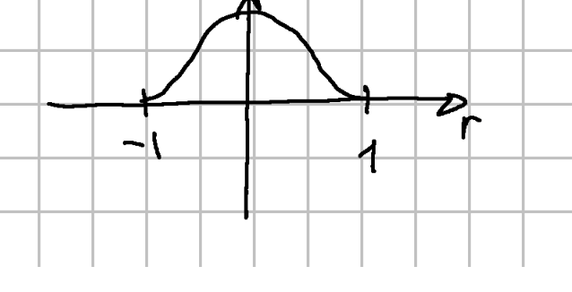
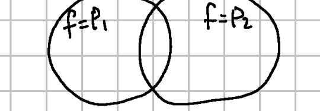
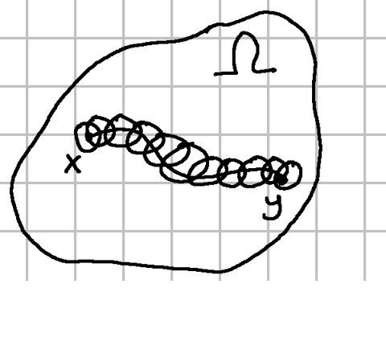

На самом деле утверждение с прошлой пары о том, что

$$\operatorname{singsupp} f*g\subset\operatorname{singsupp} f+\operatorname{singsupp} g$$

не было верным для нашего определения свертки:
**Определение (Владимира).** $f*g$ $\exists$, если $\exists\lim\langle f(x)g(y),\,\eta_k(x,y)\,\varphi(x+y)\rangle$ и не зависит от $\{\eta_k\}$.

Но это утверждение будет верным для другого определения свёртки:
**Определение (Хёрмондер).** $f*g$ $\exists$, если $\forall K\subset\mathbb{R}^n$ — компакт,

$$
S_K=\bigl\{(x,y)\in\operatorname{supp} f\times\operatorname{supp} g\bigm|\, x+y\in K\bigr\}
$$

ограничено ($\Rightarrow$ компактно).

**Утверждение.** Хёрмондер $\Rightarrow$ Владимир.
$\{\eta_k\}\qquad\lim\langle f(x)g(y),\,\eta_k(x,y)\,\varphi(x+y)\rangle$

$\varphi(x+y)\in C^\infty(\mathbb{R}^{2n}_{x,y})$

$K=\operatorname{supp}\varphi\qquad\lim\langle\varphi(x+y)\,f(x)\,g(y),\,\eta_k(x,y)\rangle$

где $\operatorname{supp}\bigl(\varphi(x+y)\,f(x)\,g(y)\bigr)$

$\ldots$

тут не успел дописать

$\ldots$

**Упражнение.** $\operatorname{singsupp} f*g\subset\overline{\operatorname{singsupp} f+\operatorname{singsupp} g}$ для Хёрмондера.

## Усреднение обобщённых функций

$$
\omega(r)=e^{-1/(1-r^2)}
$$

$$
\omega_\varepsilon(x)=\frac{1}{\varepsilon}\,\omega\Bigl(\frac{|x|}{\varepsilon}\Bigr)
$$

$\forall f\in\mathcal{D}'(\mathbb{R}^n)$

$$f*\omega_\varepsilon\ \exists$$

**Note.** $\operatorname{singsupp}\omega_\varepsilon=\varnothing\Rightarrow\operatorname{singsupp} f*\omega_\varepsilon\subset\varnothing$.

**Утверждение.** $f*\omega_\varepsilon\in C^\infty(\mathbb{R}^n)$

$\langle f*\omega,\,\varphi\rangle=$ (в достаточном условии существования свёртки была формула) $=\langle f(x)\,\omega_\varepsilon(y),\,\eta_\varepsilon(x,y)\,\varphi(x+y)\rangle$

$\eta_\xi\equiv 1$ на $\operatorname{supp}\omega_\varepsilon$, $\eta_\varepsilon\in\mathcal{D}(\mathbb{R}^n)$.

$$
=\Bigl\langle f(x),\,\bigl\langle\omega_\varepsilon(y),\,\eta_\varepsilon(x,y)\,\varphi(x+y)\bigr\rangle\Bigr\rangle
=\Bigl\langle f(x),\,\int_{\mathbb{R}^n}\omega_\varepsilon(y)\,\eta_\varepsilon(x,y)\,\varphi(x+y)\,dy\Bigr\rangle
$$

где $\omega_\varepsilon(y)\,\eta_\varepsilon(x,y)=\omega_\varepsilon(y)$.

Введем замену под интегралом: $z=x+y$. получим:

$$
=\Bigl\langle f(x),\,\int_{\mathbb{R}^n}\omega_\varepsilon(z-x)\,\varphi(z)\,dz\Bigr\rangle
$$

Далее трюк:

$$
=\bigl\langle f(x)\,\mathbb{1}(z),\,\omega_\varepsilon(z-x)\,\varphi(z)\bigr\rangle=
$$
где $\mathbb{1}(z)$ действует как интеграл, то есть как $L_{1}^{\text{loc}}$-функция.

получаем:

$$
=\Bigl\langle \mathbb{1}(z),\,\bigl\langle f(x),\,\omega_\varepsilon(z-x)\,\varphi(z)\bigr\rangle\Bigr\rangle
=\int_{\mathbb{R}^n}\bigl\langle f(x),\,\omega_\varepsilon(z-x)\bigr\rangle\,\varphi(z)\,dz
$$

и обозначим $\langle f(x),\,\omega_\varepsilon(z-x)\rangle=h(z)\in C^\infty$

$$
=\int_{\mathbb{R}^n} h(z)\,\varphi(z)\,dz
$$

(Вспомнили теорему с доказательством корректности прямого произведения, где мы показали что функция вида $\langle f(x),\,\omega_\varepsilon(z-x)\rangle\in C^\infty$)

Получили что: $f*\omega_\varepsilon=h(z)\in C^\infty$. $\square$

Введем обозначение $f_\varepsilon=f*\omega_\varepsilon$.

**Утверждение.** $f_\varepsilon\to f$ в $\mathcal{D}'(\mathbb{R}^n)$.

$\square$ $f*g_k\to f*g$, если $\operatorname{supp} g_k\subset K$, $g_k\to g$

это было упражнением на одной из прошлых пар, из него всё следует:

$\omega_\varepsilon\to\delta$, $f_\varepsilon \to f * \delta =f$ $\square$

**Замечание.** $\mathcal{D}'(\mathbb{R}^n)$ - это на самом деле замыкание (т.е. пополнение) основных функций $\mathcal{D}(\mathbb{R}^n)$, рассматриваемых как функционалы над $\mathcal{D}(\mathbb{R}^n),$ в $*$-слабой топологии.

**Теорема.** Если $D^\alpha f=0$ $\forall\,|\alpha|=\ell$ в $\Omega$, то на самом деле $f$ — многочлен степени $\le\ell-1$ на $\Omega$.

**Note.** для обычн. функц. это очев., теперь же докажем для обобщённых.

$\square$ Если доказать, что $\forall x\in\Omega$ $\exists\, B_\delta(x)\subset\Omega$, в котором $f=P_{x,\delta}$ (полином, который может зависеть и от $x$ и от $\delta$)

Если показали что в $B_1$, $f=P_1$, а в $B_2$ $f=P_2$, то в $B_1\cap B_2$ $f=P_1$ и $f=P_2$. Значит $P_1\equiv P_2$.

Возьмем $x\in\Omega$ и $B_\delta(x)\subset\Omega$. Тогда возьмем $\eta\equiv 1$ в $B_\delta$ и $\eta\in\mathcal{D}(\Omega)$

$\exists\, f\eta\in\mathcal{D}'(\mathbb{R}^n)$: $\varphi\in\mathcal{D}(\mathbb{R}^n)$

$$\langle f\eta,\,\varphi\rangle=\langle f,\,\eta\varphi\rangle$$

где $f\in\mathcal{D}'(\Omega)$, $\eta\varphi\in\mathcal{D}(\Omega)$, $\eta f=f$ в $B_\delta$.

$\exists\,(f\eta)_\varepsilon\in C^\infty(\mathbb{R}^n)$

$$D^\alpha(f\eta)=(D^\alpha f\eta)_\varepsilon\qquad\forall\,|\alpha|=\ell.$$

Т.к. раньше мы уже говорили, что $f*g$: $D^\alpha(f*g)=(D^\alpha f)*g=f*(D^\alpha g)$

$D^\alpha f\eta=D^\alpha f=0$ в $B_\delta$.

$$
\operatorname{supp} D^\alpha f\eta\subset B_\delta^c;\qquad
\operatorname{supp} D^\alpha(f\eta)_\varepsilon\subset\overline{\operatorname{supp} D^\alpha f\eta+B_\varepsilon(0)}
\subset\overline{B_\delta^c+B_\varepsilon(0)}
\subset B_{\delta-\varepsilon}(x)\
\subset B_{\delta/2}^c(x)
$$
Считая что $\varepsilon<\delta/2$
Получаем: $D^\alpha(f\eta)_\varepsilon=0$ в $B_{\delta/2}(x)$ — это $C^\infty$-функция.

$\Rightarrow$ $(f\eta)_\varepsilon=P_\varepsilon\in\mathcal{P}^{\ell-1}$ в $B_{\delta/2}$

Сделаем трюк: на пространстве полиномов $\mathcal{P}^{\ell-1}$ введем скалярное произведение.

$$
(P_1,P_2):=\int_{\mathbb{R}^n} P_1(y)\,P_2(y)\,\omega_{\delta/2}(y-x)\,dy
$$

где вместо $\omega_{\delta/2}(y-x)\in\mathcal{D}(B_\delta)$ могла бы подойти и любая другая из $\mathcal{D}(B_{\delta/2})$.

Тогда, естественно, мономы $\{y^\beta\}_{|\beta|\le\ell-1}$ образуют базис на пространстве полиномов $\mathcal{P}^{\ell-1}$. А из алгебры существует дуальный базис для этого скалярного произведения.
То есть $\exists\,\{\psi_\gamma\}_{|\gamma|\le\ell-1}$ — базис $\mathcal{P}^{\ell-1}$ (так как $\mathcal{P}^{\ell-1}$ конечномерно) и

$$
(y^\beta,\psi_\gamma)=\delta_{\beta,\gamma}\quad\text{(дельта функция Кронекера)}
$$

$$
(y^\beta,\psi_\gamma)=\int_{\mathbb{R}^n} y^\beta\,\psi_\gamma(y)\,w(y-x)\,dy
$$

обозначим $\psi_\gamma(y)\,w(y-x)=h_\gamma(y)\in C_0^\infty$.

$\langle(f\eta)_\varepsilon,\,h_\gamma\rangle\to\langle f\eta,\,h_\gamma\rangle$ с одной стороны, а с другой:

$$
\langle(f\eta)_\varepsilon,\,h_\gamma\rangle=\langle P_\varepsilon,\,h_\gamma\rangle
=\sum_{|\beta|\le\ell-1} C_{\beta,\varepsilon}\,\langle y^\beta,\,h_\varepsilon(y)\rangle\
=C_{\gamma,\varepsilon},
$$

где $P_\varepsilon=\sum_{|\beta|\le\ell-1} C_{\beta,\varepsilon}\, y^\beta$.

Таким образом $C_\gamma:=\langle f\eta,\,h_\gamma\rangle$.

$$
P=\sum_{|\beta|\le\ell-1} C_\beta\, y^\beta
$$

$C_{\beta,\varepsilon}\to C_\beta\Rightarrow P_\varepsilon\to P$ в $L^1_{\mathrm{loc}}(\mathbb{R}^n)$ и тем более в $\mathcal{D}'(B_{\delta/2})$

Т.о. получили, что в $\mathcal{D}(B_{\delta/2})$

$$
\begin{aligned}
P_\varepsilon&\to P\\
&\parallel\\
(f\eta)_\varepsilon&\to f\eta
\end{aligned}
$$

То есть $P=f\eta=f$ в $B_{\delta/2}$. Следовательно нашли шар котором наша функция есть полином, что и требовалось $\square$

## Фундаментальное решение дифференциального оператора

Пусть есть дифф. оператор $L=P(D)$

Рассматриваем уравнение $Lu=f$ (например $-\Delta u=f$)

и хотим его решить.

Ну давайте сначала найдем решение $Lu=\delta$. Пусть это решение $\exists$, обозначим его $\mathcal{E}$.

Рассмотрим $u_f:=\mathcal{E}*f$ (если $\exists$ свёртка)

$$
Lu_f=P(D)(\mathcal{E}*f)=(P(D)\mathcal{E})*f=\delta*f=f.
$$

То есть решив одно уравнение $Lu=\delta$ мы сразу имеем тривиальным образом все решения для $Lu=f$.

**Теорема.** $\forall\, P$ — полином с постоянными коэффициентами, для $L=P(D)$ $\exists$ фундаментальное решение.

**Пример.** хотим решить $\sum_{k=0}^{n} C_k u^{(k)}=f$

ну надо найти фунд. реш. $\sum_{k=0}^{n} C_k u_{\text{фунд.}}^{(k)}=\delta$

общее решение $=u_{\text{фунд.}}*f$.

**Упражнение.**

$$
\begin{cases}
\sum C_k u^{(k)}=0\\
u^{(k)}=0\quad\forall k<n-1\\
u^{(n-1)}=1
\end{cases}
$$

## Задача Коши для волнового уравнения в терминах обобщённых функций

$$
\begin{cases}
u_{tt}-a^2\Delta u=f(x,t),\quad t>0\\
u\big|_{t=0}=\varphi\\
u_t\big|_{t=0}=\psi
\end{cases}
\qquad u\in C^2\bigl(\mathbb{R}^n\times\mathbb{R}_{\ge 0}\bigr)
$$

Попробуем вывести уравнение в обобщенных функциях:

$$
U(x,t)=
\begin{cases}
u(x,t),& t\ge 0\\
0,& t<0
\end{cases}
\;\;\;
\in L^1_{\mathrm{loc}}(\mathbb{R}^n)
$$

$U\in L^1_{\mathrm{loc}}(\mathbb{R}^n)\Rightarrow U$ — обобщенная функция.

$$
\langle U_{tt}-a^2\Delta U,\, h\rangle
=\langle U,\, h_{tt}-a^2\Delta h\rangle
=\int_{\mathbb{R}^n}\int_0^\infty U\,(h_{tt}-a^2\Delta h)\,dt\,dx
$$

Воспользуемся формулой интегрирования по частям.
![[supp-h-upper.png|399]]![[supp-h-lower.png|342]]
$$
\int_0^\infty\int_{\mathbb{R}^n}(u_{tt}-a^2\Delta u)\,h\,dx\,dt
-\int_{\mathbb{R}^n} u\, h_t\Big|_{t=0}
+\int_{\mathbb{R}^n} u_t\, h\Big|_{t=0}=
$$

$$
=\int_0^\infty\int_{\mathbb{R}^n} f(x,t)\,h(x,t)\,dx\,dt
-\int_{\mathbb{R}^n}\varphi(x)\,h(x,0)\,dx
+\int_{\mathbb{R}^n}\psi(x)\,h(x,0)\,dx=
$$

$$
=\langle F,\, h\rangle+\langle\varphi(x)\,\delta'(t),\, h\rangle+\langle\psi(x)\,\delta(t),\, h\rangle
$$

где

$$
F(x,t)=
\begin{cases}
f(x,t),& t\ge 0\\
0,& t<0.
\end{cases}
$$

В итоге мы получили обобщённую постановку задачи Коши для волнового уравнения:

$$
U_{tt}-a^2\Delta U=F(x,t)+\varphi(x)\,\delta'(t)+\psi(x)\,\delta(t)
$$

— волновое уравнение в обобщенных функциях.

Фундаментальное решение — это решение $U_{tt}-a^2\Delta U=\delta(x,t)$, т.е. $F=0$, $\varphi=0$, $\psi\to\delta$

$$
\begin{cases}
u_{tt}-a^2\Delta u=0\\
u\big|_{t=0}=0\\
u_t\big|_{t=0}=\psi
\end{cases}
$$

т.е. если мы знаем реш., то знаем реш. $\forall\,\delta$ и $\forall \varphi$.

Если $u$ — решение исходного, то $U$ — решение

$$
U_{tt}-a^2\Delta U=F(x,t)+\varphi(x)\,\delta'(t)+\psi(x)\,\delta(t)
$$

**Упражнение.** если $U$ — решение верхнего уравнение и $U\in C^2\bigl(\mathbb{R}^n\times\mathbb{R}_{\ge 0}\bigr)$, тогда $u=U\big|_{\{t\ge 0\}}$ — решение исходного.

**Для $n=1$:** воспользуемся формулой Даламбера:

$$
u(x,t)=\int_{x-at}^{x+at}\psi(y)\,dy
$$
— решение

$$
\begin{cases}
u_{tt}-a^2\Delta u=0\\
u\big|_{t=0}=0\\
u_t\big|_{t=0}=\psi
\end{cases}
$$

Если устремить $\psi\to\delta$, то

$$
u(x,t)\to\int_{x-at}^{x+at}\delta(y)\,dy
=
\begin{cases}
1,& 0\in(x-at,\, x+at)\\
0,& 0\notin(x-at,\, x+at)
\end{cases}
$$

$=$ характеристическая функция.

Вообще сейчас мы нестрого показали, что:
$$
u=\chi_{[-at,\, at]}(x)\ \text{— фунд. реш.}
$$